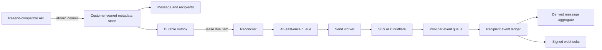

# Production semantics and Cloudflare proof

This is the execution plan for the product direction accepted in
[issue #81](https://github.com/haya-inc/hayasend/issues/81). HayaSend is the
customer-owned safety and reliability control plane between applications or
agents and an email delivery provider:

> **One email API. Your cloud. Any provider.**

AWS is the implemented data plane today. Cloudflare is the next provider
proof, not a promise of current production support. Work advances by evidence
gates rather than dates or feature count.

## Product invariants

Every adapter, deployment target, and optional commercial service must preserve
these invariants:

1. The self-hosted Apache-2.0 data plane remains useful without a Haya service.
2. Message bodies, attachments, recipient addresses, and provider credentials
   stay in the customer's cloud account.
3. A successful API response means the message and its dispatch intent are
   durably committed together.
4. Queue delivery, provider delivery, and webhook delivery are described
   honestly as at least once where that is the real boundary.
5. Duplicate and out-of-order provider events cannot erase recipient history or
   move recipient state backward.
6. Message status is derived from recipient truth. It is not the only canonical
   lifecycle record.
7. Provider limits and capabilities are visible to callers and conformance
   tests. HayaSend does not pretend that providers behave identically.
8. Logs and default operator output exclude bodies, subjects, addresses,
   secrets, signed URLs, and raw provider errors.
9. Deploy, upgrade, rollback, recovery, and provider migration have executable
   evidence before a target is called production-ready.
10. Agent-facing interfaces arrive only after permissions, policy, budgets,
    approval, audit, and kill switches exist underneath them.

## Current evidence and gaps

The AWS implementation already has useful foundations:

- the email and idempotency claim are stored in one DynamoDB transaction;
- SQS and worker retries use a conditional send lease;
- message payloads are separated into encrypted S3;
- provider and webhook errors are reduced to privacy-safe categories;
- SDK, OpenAPI, local-container, and deployment safety checks exist.

The remaining production-semantic gaps are concrete:

- email persistence and SQS or Scheduler dispatch are separate operations;
- recovery of a stored but undispatched email currently depends on a client
  replaying the identical idempotent request;
- an SES acceptance followed by a worker crash before recording the provider ID
  can still cause a duplicate provider submission;
- `EmailRecord.status` is one aggregate value for all To, Cc, and Bcc
  recipients;
- provider events are not retained as an immutable, idempotent recipient
  ledger;
- provider capability and failure classification are implicit in individual
  adapters;
- conformance tests do not yet run the same lifecycle and fault suite against
  every store, queue, scheduler, and mail provider combination.

Drafts #49, #51, and #53 are valuable risk reductions. They do not by
themselves constitute a transactional outbox or recipient-level truth.

## Target data-plane model

The public Resend-compatible message remains the API entry point. Internally,
the canonical model separates five records:

| Record         | Responsibility                                      | Required identity                             |
| -------------- | --------------------------------------------------- | --------------------------------------------- |
| Message        | Immutable send intent and derived aggregate         | HayaSend message ID                           |
| Recipient      | One normalized envelope recipient and current state | Opaque recipient ID                           |
| Attempt        | One provider submission attempt                     | HayaSend attempt ID plus optional provider ID |
| Provider event | Immutable normalized lifecycle fact                 | Provider and provider event ID                |
| Outbox item    | Durable intent to enqueue or wake work              | Deterministic job ID                          |

Recipient addresses remain encrypted inside the customer data plane. Opaque
recipient IDs, counts, states, timestamps, provider name, version, health, and
aggregate cost may be exported deliberately; addresses, subjects, bodies,
attachments, and raw SMTP responses may not.

### Transactional outbox

Creating a message atomically writes:

- the message;
- its idempotency claim, when present;
- one recipient row per unique envelope recipient;
- a deterministic outbox item with `due_at`, attempt count, and no dispatched
  timestamp.

The API does not enqueue directly. A reconciler conditionally leases due outbox
items, publishes deterministic jobs, and records dispatch. A crash after queue
acceptance but before dispatch acknowledgement can create duplicate queue jobs;
the deterministic job ID and send lease collapse concurrent work.

Scheduled resources are wake-up optimizations, not the source of truth. A
bounded sweep must eventually recover every due outbox item even if creation of
an EventBridge schedule, Cloudflare delayed message, or timer failed.

Provider submission is not called exactly once unless the provider exposes and
HayaSend verifies a durable idempotency primitive. A crash after provider
acceptance but before the attempt is recorded remains an explicit ambiguous
boundary. The conformance report records that capability per provider and the
operations guide provides a reconciliation procedure.

### Recipient lifecycle

Each provider event is normalized before it mutates state:

- deduplicate on `(provider, provider_event_id)`;
- correlate the provider message ID and normalized recipient to one attempt;
- retain the event type, provider timestamp, receipt timestamp, terminal flag,
  and allowlisted diagnostic category;
- discard subject, raw SMTP text, provider exception text, and unrecognized
  fields;
- apply an explicit transition table conditionally;
- publish the normalized outward webhook even when a duplicate or older event
  does not change current state.

Complaint and suppression outcomes remain safety-sticky. Delivery, engagement,
temporary delay, permanent bounce, rejection, and internal failure are
separate facts. A mixed-recipient send must not hide one recipient's bounce
behind another recipient's delivery. The compatible message response may keep
a conservative aggregate, while an additive recipient endpoint exposes the
canonical per-recipient result.

### Provider capability contract

Every provider adapter declares a versioned capability document, including at
least:

- maximum serialized and MIME message bytes;
- maximum combined recipients;
- attachment, custom-header, scheduling, cancellation, and batch behavior;
- accepted, delivered, delayed, bounced, complained, rejected, open, and click
  event support;
- provider message and event identifiers;
- provider-side idempotency support and its retention window;
- retryable and permanent error mappings;
- domain-verification and suppression behavior;
- current service maturity and required plan.

The API validates the selected provider's lower limit before durable commit.
`doctor` reports effective limits and missing capabilities. A deployment must
not silently fall back to a different provider.

## Evidence gates

### Gate 0 — Ship and freeze the AWS beta

Entry:

- release PR #30 is the reviewed candidate.

Deliverables:

- independent approval and protected-main merge;
- zero untriaged CodeQL alerts on the exact merged commit;
- one successful deploy, test, and delete in an explicitly dedicated empty AWS
  account;
- signed `v0.1.0` tag, verified artifacts and provenance, live project site.

Exit evidence:

- every link and cleanup result required by
  [release issue #22](https://github.com/haya-inc/hayasend/issues/22).

Non-goals:

- no post-v0.1 draft is merged into the frozen release;
- no branch-protection bypass;
- no use of an unrelated HayaMail AWS account.

### Gate 1 — Make AWS semantics recoverable and recipient-correct

Entry:

- Gate 0 is complete;
- the relevant drafts have been retargeted and refreshed in the order below.

Deliverables:

1. Publish provider capabilities and a compatibility contract backed by
   generated conformance cases.
2. Land permanent/retryable failure classification and short-term dispatch
   repair from #49 and #51.
3. Add provider-neutral outbox types, store operations, leases, metrics, and a
   memory-store model.
4. Implement DynamoDB atomic message/idempotency/recipient/outbox writes and a
   continuously recoverable dispatcher.
5. Add immutable provider-event and recipient-attempt records, then rebase the
   monotonic transition work from #53 onto that ledger.
6. Expose recipient summaries through an additive, privacy-reviewed API and
   derive the existing message aggregate.
7. Run the same lifecycle, duplicate, ordering, lease, and failure suite against
   memory and AWS adapters.
8. Add `doctor` and operations output for oldest outbox age, stuck leases,
   queue/DLQ depth, event lag, and provider capability drift.

Exit evidence:

- a commit-before-enqueue crash is recovered without a client retry;
- failure injection after every durable write and external call loses no
  committed message;
- duplicate queue jobs cause at most one concurrent provider submission;
- the provider-acceptance ambiguity is measured and documented, not hidden;
- generated duplicate and out-of-order events never regress a recipient;
- mixed-recipient delivery retains every outcome and derives a deterministic
  aggregate;
- no fixture, log, metric dimension, error, or default CLI output leaks message
  content or an address;
- upgrade and rollback are exercised on a disposable AWS stack with cleanup.

Non-goals:

- no claim of exactly-once provider delivery;
- no Cloudflare production label;
- no MCP or broad policy engine.

### Gate 2 — Prove the same contract on Cloudflare

Cloudflare facts in this section were checked against official documentation on
2026-07-26 and must be rechecked when implementation starts:

- outbound [Email Sending is Beta and requires Workers Paid](https://developers.cloudflare.com/email-service/);
- the normal production limits are
  [50 combined recipients and 5 MiB including attachments](https://developers.cloudflare.com/email-service/platform/limits/);
- new accounts receive adaptive daily limits rather than a fixed quota that
  HayaSend can assume;
- the Workers binding and REST API return a provider message ID;
- per-domain
  [event subscriptions](https://developers.cloudflare.com/email-service/platform/event-subscriptions/)
  currently provide recipient-level delivered, deferred, bounced, failed,
  rejected, and complained events through Queues;
- [Queues are at least once](https://developers.cloudflare.com/queues/reference/delivery-guarantees/)
  and therefore require deterministic IDs and idempotent consumers;
- [D1 batches are transactions](https://developers.cloudflare.com/d1/worker-api/d1-database/)
  that roll back the sequence on failure;
- [R2 object operations are strongly consistent](https://developers.cloudflare.com/r2/reference/consistency/),
  while IAM changes are eventually consistent;
- current [Email Service pricing](https://developers.cloudflare.com/email-service/platform/pricing/)
  is useful cost input, not a value to hard-code into policy.

No Cloudflare documentation reviewed here promises provider-side send
idempotency. Treat it as unsupported until a controlled test and an explicit
contract prove otherwise. Open and click events are also not listed in the
current Email Sending event subscription set, so the adapter must report them
as unsupported rather than fabricate parity.

Deliverables:

1. Make the core compile in the Workers runtime without importing Node-only
   APIs through domain services.
2. Add a D1 store with atomic message, idempotency, recipients, event, and
   outbox operations.
3. Add R2 payload storage with checksum, size, retention, and orphan cleanup.
4. Add Cloudflare Queues producer, consumer, retries, deterministic jobs, and
   DLQ recovery.
5. Add the Email Sending binding transport and normalize its documented error
   codes without retaining provider error text.
6. Consume per-domain Email Sending subscriptions and correlate `messageId`,
   `eventId`, and recipient to the canonical ledger.
7. Provide plan-first `deploy cloudflare`, `doctor`, upgrade, and rollback
   workflows using pinned tooling and a disposable test account.
8. Publish a capability and conformance report beside the AWS report.
9. Publish a reproducible cost model using observed Worker, D1, R2, Queue, and
   Email Service usage.

Exit evidence:

- official Resend SDK requests run unchanged against both AWS and Cloudflare;
- all shared conformance cases pass or show an explicit documented capability
  difference;
- the 50-recipient and 5 MiB boundaries fail before durable commit;
- duplicate Queue deliveries and duplicate/out-of-order Email events converge;
- D1 write failure, R2 orphan, Queue failure, DLQ recovery, deploy failure, and
  rollback are exercised;
- a controlled provider switch changes deployment configuration but not
  application send code;
- the Cloudflare report continues to say Beta until Cloudflare and HayaSend
  evidence justify changing it.

Non-goals:

- no inbound-email feature expansion;
- no provider-neutral claim for events Cloudflare does not publish;
- no managed Haya content plane.

### Gate 3 — Dogfood with FolioMCP

Entry:

- Gates 1 and 2 pass in disposable environments.

Scope:

- non-critical PDF completion and failure notifications;
- sharing notifications;
- quota warnings;
- operator alerts.

The workload uses the ordinary Resend-compatible API. Provider selection is
deployment configuration. It uses scoped credentials, controlled recipients,
idempotency keys, and metadata-only operator output.

Exit evidence:

- at least 1,000 controlled notifications and 14 consecutive days;
- zero unexplained lost committed messages;
- duplicate rate, queue-to-provider latency, event lag, recovery time, and
  operator time are published;
- a provider migration and rollback drill completes without application-code
  changes;
- no message body, address, subject, token, or signed URL reaches Haya-managed
  telemetry or public issue data;
- every incident found becomes a minimized regression test before the proof is
  declared complete.

Non-goals:

- critical customer traffic;
- deliverability or inbox-placement guarantees;
- using dogfood volume to bypass provider quotas or policy.

### Gate 4 — Add agent-safe policy

Only after the delivery foundation is evidenced:

- actor, application, agent, and intent identity;
- separate `email:draft`, `email:send`, and external-send scopes;
- recipient and domain rules;
- hourly/daily send and cost budgets;
- approval gates for external, sensitive, attachment, or high-volume sends;
- sandbox sink, preview, kill switch, and immutable audit;
- MCP as a thin interface over those enforced primitives.

Policy decisions, audit records, and enforcement remain in the customer data
plane. An MCP server may not become a privileged bypass around the ordinary
API.

## Fault and conformance matrix

Every adapter report uses the same named cases:

| Boundary               | Injected condition                   | Required outcome                                     |
| ---------------------- | ------------------------------------ | ---------------------------------------------------- |
| API commit             | failure inside atomic write          | no partial message or idempotency claim              |
| Outbox dispatch        | queue unavailable                    | committed item remains due and observable            |
| Outbox acknowledgement | crash after queue acceptance         | duplicate job is safe                                |
| Send lease             | concurrent or expired consumers      | one active claimant per lease                        |
| Provider call          | permanent rejection                  | no retry; recipient records terminal reason category |
| Provider call          | throttle or unavailable              | bounded retry with backoff                           |
| Provider acceptance    | crash before attempt update          | ambiguity recorded and measurable                    |
| Provider events        | duplicate or older event             | immutable dedupe and no state regression             |
| Recipient aggregate    | mixed delivery and bounce            | neither outcome is lost                              |
| Payload store          | object write without metadata commit | bounded orphan cleanup                               |
| Webhook                | timeout or duplicate queue job       | stable event ID for automatic retries                |
| Deploy                 | interrupted migration                | safe retry or documented rollback                    |
| Telemetry              | adversarial private fields           | no content or address leaves the data plane          |

The test runner records adapter version, capability document digest, case
count, pass/fail/unsupported status, and evidence URL. “Unsupported” is valid
only for a declared provider capability; it cannot mask a failed core
invariant.

## First implementation slices

After Gate 0, open these focused issues in order:

1. Define provider capabilities and the versioned conformance result schema.
2. Introduce recipient, attempt, provider-event, and outbox domain types without
   changing the public API.
3. Add atomic outbox operations and a deterministic memory-store reconciler.
4. Add DynamoDB outbox transactions, due-item index, dispatcher, and alarms.
5. Add recipient-event dedupe, transition property tests, and derived
   aggregates.
6. Expose additive recipient summaries and recovery diagnostics.
7. Create a Workers runtime skeleton and compile-time Node-dependency guard.
8. Implement D1, R2, and Queues adapters with local fault tests.
9. Implement Cloudflare Email Sending and event-subscription adapters.
10. Add Cloudflare deploy, doctor, rollback, conformance, and cost evidence.
11. Run and publish the FolioMCP dogfood proof.

Each slice needs its own issue, signed commit, independent review, CI, CodeQL
or equivalent static analysis, and relevant disposable-account integration
evidence. A later slice must not be used to excuse a missing earlier invariant.

## Existing post-v0.1 draft disposition

Nothing in this table authorizes merging before Gate 0 or bypassing normal
review. After the release, every “rebase and review” item targets the then
current `main`, reruns all required checks, and receives independent approval.

| PR  | Disposition                   | Reason and dependency                                                                                                        |
| --- | ----------------------------- | ---------------------------------------------------------------------------------------------------------------------------- |
| #33 | Park                          | Inbound alias routing is explicitly deferred. Preserve the design for later review; do not implement it now.                 |
| #34 | Rebase and review             | Bounded logs support AWS production operations. It does not block provider-neutral semantics.                                |
| #41 | Rebase and review             | Plain-text fallback is compatibility behavior; merge only with a conformance case.                                           |
| #43 | Rebase and review early       | Provider message ID is required for attempt and event correlation.                                                           |
| #45 | Rebase and review             | Conservative AWS throttling supports safe deployment and cost control.                                                       |
| #47 | Rebase and review             | Stable domain errors belong in the compatibility contract.                                                                   |
| #49 | Combine into semantics series | First patch in the retry/outbox series: permanent versus retryable provider errors.                                          |
| #51 | Combine into semantics series | Keep as immediate risk reduction, then replace client-triggered repair with durable outbox reconciliation. Rebase after #49. |
| #53 | Combine into semantics series | Keep aggregate monotonicity as a bridge, then rebase its transition tests onto the recipient ledger after #51.               |
| #55 | Park                          | A third language SDK is explicitly lower priority than shared provider conformance. Revisit after Cloudflare proof.          |
| #57 | Rebase and review early       | The complete OpenAPI property gate is part of the public compatibility contract.                                             |
| #59 | Rebase and review             | Attestable npm distribution is required for safe install and deploy workflows.                                               |
| #61 | Rebase and review after #59   | Preserve the stack. Packaged plan-first deploy depends on the npm distribution changes.                                      |
| #63 | Rebase and review             | Scoped credential onboarding is a current production gate.                                                                   |
| #65 | Rebase and review             | Domain setup and canary guidance are required for deploy-to-first-send.                                                      |
| #67 | Rebase and review after #57   | Publish the validated contract as a static reference; generated docs must follow the contract gate.                          |
| #69 | Rebase and review             | Webhook inspection and replay are in the supported recover workflow.                                                         |
| #71 | Rebase and review             | Suppression operation is a core deliverability safeguard, not a marketing feature.                                           |
| #73 | Rebase and review             | Privacy-safe send inspection, cancel, and recover are in the focused CLI boundary.                                           |
| #75 | Rebase and review after #73   | Preserve the stack. Production send is the allowed CLI path, not broad CRUD parity.                                          |
| #77 | Park                          | Full inbound inspection is outside the immediate production/Cloudflare proof. Preserve it without merging.                   |
| #79 | Rebase and review early       | Stable resource-ID keyset pagination fixes a public contract and avoids insertion gaps.                                      |
| #82 | Park with #77                 | Receiving listen depends on #77 and is outside the immediate proof. Do not retarget it ahead of its parent.                  |

The superseded pre-release integration chain #4–#29 is closed with explanatory
comments only after #30 merges, as required by release issue #22.

## Commercial boundary

The open data plane includes provider adapters, conformance, deploy, doctor,
safe upgrade and rollback, recovery, security fixes, and a usable operations
runbook. Paid value must not be created by withholding those foundations.

An optional Haya management plane may provide:

- fleet inventory, version, drift, and health management;
- orchestrated upgrades, rollback, and failure drills;
- aggregate cost and service-level reporting;
- compliance evidence and audit exports;
- production support, incident response, migration, and deliverability review;
- certified provider-adapter support.

By default it receives only deployment identity, software and adapter version,
capability digest, health, counts, durations, cost aggregates, and opaque
incident references. It does not receive recipients, sender addresses,
subjects, bodies, attachments, provider credentials, raw provider events, or
signed URLs.

## Success metrics

The primary outcome is the number of production workloads that can change
provider without application-code changes while retaining an auditable
recipient-level delivery history.

Each release report publishes:

- time to first controlled delivered email;
- conformance pass rate by adapter and version;
- committed messages not dispatched;
- provider submissions per logical message and ambiguous acceptances;
- queue-to-provider latency and provider-event lag;
- DLQ depth and oldest outbox age;
- recovery and rollback time;
- provider migration time;
- operator minutes per 10,000 sends;
- data-plane content leakage incidents, with a target of zero.
